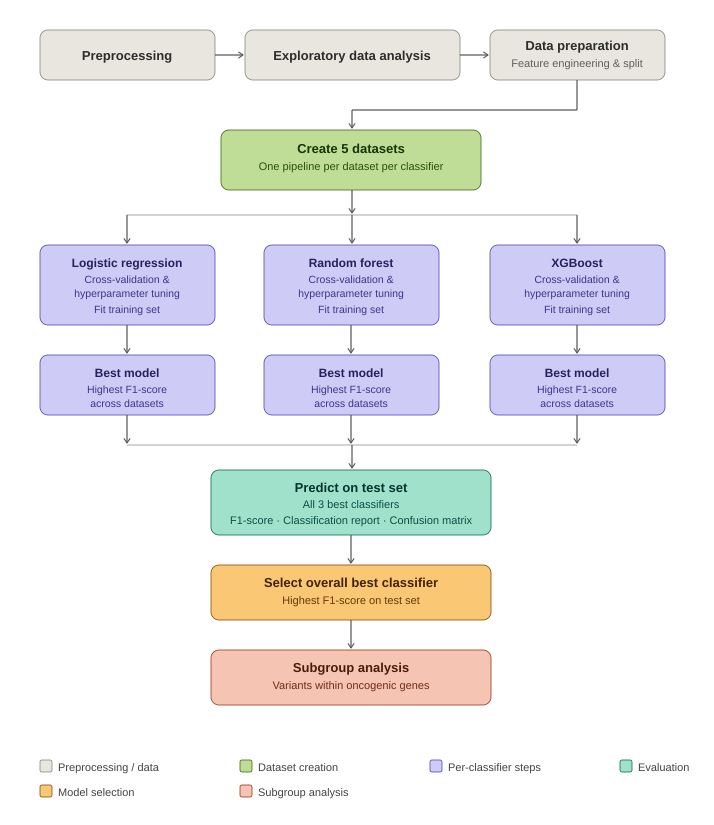

# Machine Learning Pipeline: Cancer Variant Classification 🧬🧬

This repository contains a machine learning pipeline for classifying somatic 
cancer variants from the GENIE dataset as oncogenic or likely neutral. Three 
classifiers are compared (Logistic Regression, Random Forest, XGBoost) across 
multiple feature sets, with Random Forest achieving the best performance.

<figure>
  

    
  

  <figcaption align="center">
    <b>Figure 1:</b> Machine learning pipeline for oncogenicity classification. The pipeline begins with preprocessing and exploratory data analysis, followed by data preparation including feature engineering and data splitting. Five datasets were constructed, each passed through three classifiers (Logistic Regression, Random Forest and XGBoost). Cross-validation and hyperparameter tuning were applied to each classifier. The best performing model per classifier is selected based on F1-score. All three models are evaluated on the test set using F1-score, classification report and confusion matrix. The overall best classifier was identified and applied to subsets of variants within oncogenic genes. The figure was designed by the author and rendered using the Claude (Anthropic) language model. 
  </figcaption>
</figure>

The pipeline produces trained models for the three classifiers, including model evaluation
and feature importances/coefficients. 

In order to run these scripts, an annotated variant file is needed. 
Please follow the instructions in the repositories listed below. 

1. https://github.com/anekleiven/genie_oncokb_processing_scripts
2. https://github.com/anekleiven/cancer_variants_annotation_pipeline
3. https://github.com/anekleiven/explore_cancer_variants

## Requirements 💻
- Python 3.10+

## Setup Instructions 🔧

1. **Create Virtual Environment:**
`python -m venv .venv`
`. .venv/bin/activate`

2. **Install Python Requirements:**
`pip install -r requirements.txt`

## Script Descriptions 🗒️

`01_Preprocessing.ipynb`: Data preprocessing prior to exploratory analysis (create new columns, feature selection for modeling, create ML-dataframe, filter variants to target oncogenic classes, check for missing values, handle missing gnomAD_AF values). 

`02_Exploratory_Analysis.ipynb`: Exploratory data analysis prior to ML (initial data inspection, descriptive statistics, target value analysis, univariate analysis, multivariate analysis, top genes). 

`03_Data_preparation.ipynb`: Data preparation prior to ML-modeling (log transformation, drop redundant columns, map target to binary numbers, feature engineering, data splitting, identify outliers). 

`04_Model_Training.ipynb`: ML-modeling and model evaluation (Logistic regression, Random Forest and XGBoost). 

## Recommended Sources 🛜

- AACR Project GENIE: https://www.aacr.org/professionals/research/aacr-project-genie/
- OncoKB: https://www.oncokb.org

